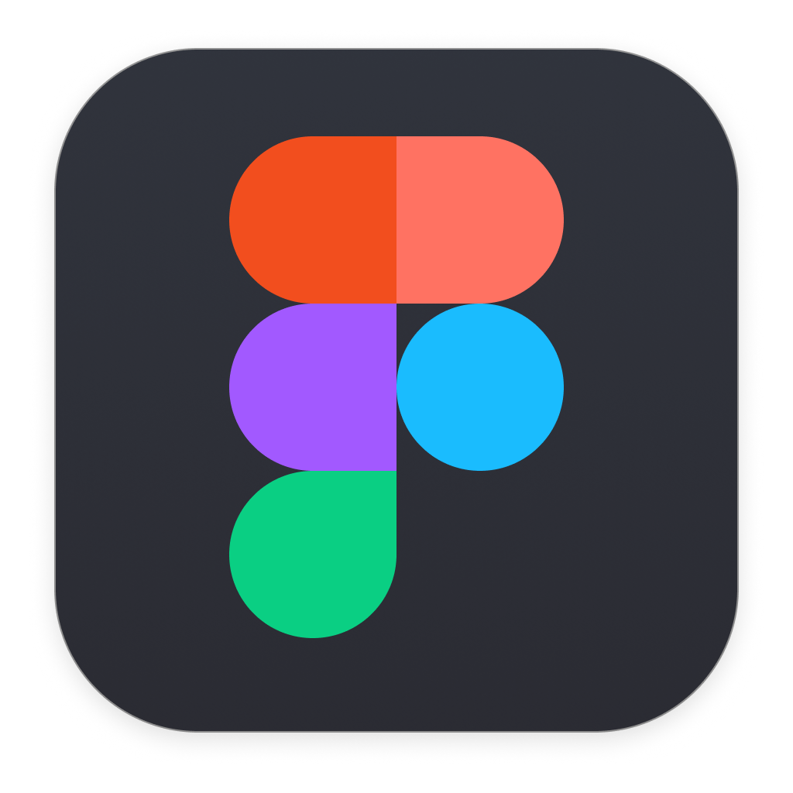

# Hello, World! 🚀

## I'm Kritika, your friendly neighborhood developer! 👩‍💻✨

Welcome to the realm of possibilities in my GitHub playground! I go by the alias 'The Great Kritika' because, well, why not?

## 🌱 Currently Exploring

I'm currently honing my skills as a Software Development Intern at [Airlyft](https://airlyft.one), where I dive into exciting projects and technologies.

## 🛠 Skills

## 🔭 Projects

Here are some of the projects I've worked on:

- **[KaizenYou Website](https://www.kaizenyou.in/)**: Developed an edtech platform using Next.js and Tailwind CSS.
- **[Liftfest Website](https://github.com/EnLit-FoET/litfest)**: Managed a literature fest website with Vue.js and Firebase.
- **[Vaccination Reminder](https://github.com/Kritikasingh2004/Vacci-Time.git)**: Created a web app to help parents track their child's vaccination schedule.

## 🌐 My Portfolio

Check out my portfolio for more projects and information about me: [The Great Portfolio](https://www.kritika.tech/)

## 💬 Let's Collaborate!

Feel free to reach out for collaboration! 🤝

## 📊 GitHub Stats

Thanks a ton for dropping by my coding lair! 🎉 Let's keep the code fires burning! 🔥
